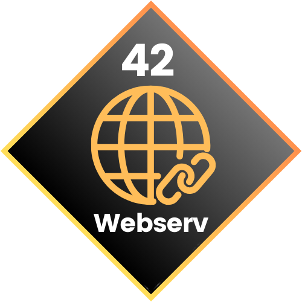

<div align="center">
  
  <h2>42 Webserv Project</h2>
    <a href= https://github.com/emre-mr246/42-evaluation></a>
    <a href= https://github.com/emre-mr246/42-evaluation></a>
    <a href="https://42istanbul.com.tr/"></a>
    <a href= https://github.com/emre-mr246/42-evaluation></a>
    <a href= https://github.com/emre-mr246/42_ring5_webserv></a>
    <a href="https://42istanbul.com.tr/"></a>
   
<h4>
    <a href="https://github.com/emre-mr246/42_ring5_webserv/issues">❔ Ask a Question</a>
  <span> · </span>
    <a href="https://github.com/emre-mr246/42_ring5_webserv/issues">🪲 Report Bug</a>
  <span> · </span>
    <a href="https://github.com/emre-mr246/42_ring5_webserv/issues">💬 Request Feature</a>
</h4>
</div>


## Introduction 🚀


## Features 🔍


## Usage ⚙️


### Build and Run

1.  **Clone the repository :**
    ```bash
    git clone <repository_url> webserv
    cd webserv
    ```
